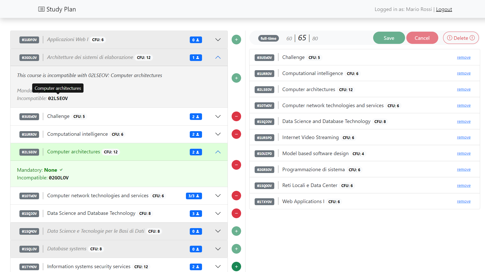

# Exam #1234: "Exam Title"
## Student: s123456 LASTNAME FIRSTNAME 

## React Client Application Routes

- Route `/`: page content and purpose
- Route `/something/:param`: page content and purpose, param specification
- ...

## API Server

- POST `/api/login`
  - request parameters and request body content
  - response body content
- GET `/api/something`
  - request parameters
  - response body content
- POST `/api/something`
  - request parameters and request body content
  - response body content
- ...

## API Server2

- GET `/api/something`
  - request parameters
  - response body content

## Database Tables

- Table `users` - contains xx yy zz
- Table `something` - contains ww qq ss
- ...

## Main React Components

- `ListOfSomething` (in `List.js`): component purpose and main functionality
- `GreatButton` (in `GreatButton.js`): component purpose and main functionality
- ...

(only _main_ components, minor ones may be skipped)

## Screenshot

## Users Credentials

- username, password (plus any other requested info which depends on the text)
- username, password (plus any other requested info which depends on the text)

